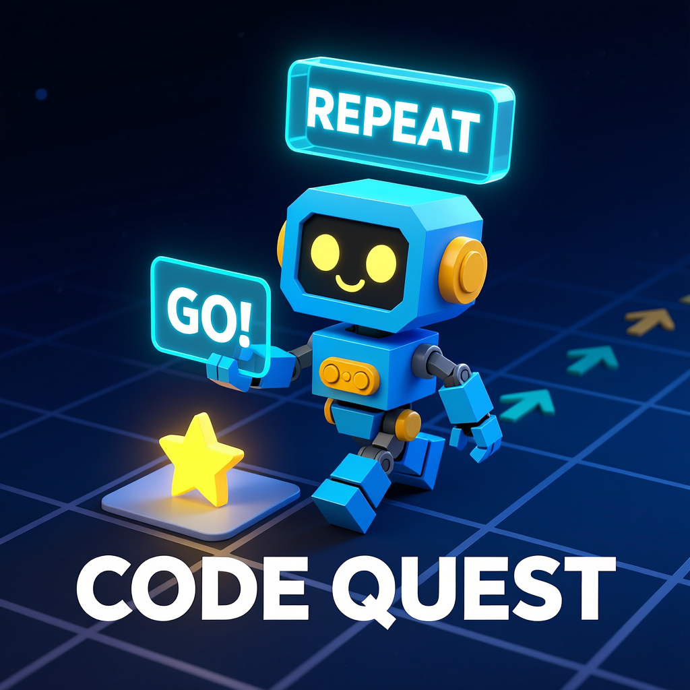

# Robot Coder - Образовательная игра по программированию

[](https://unity.com/)
[](https://unity.com/)
[](LICENSE)

Увлекательная образовательная игра, которая учит основам программирования через визуальное блочное программирование. Управляйте роботом через сложные уровни, создавая программы с помощью перетаскивания команд!



## 🎯 О игре

Robot Coder - это инновационная образовательная платформа, разработанная для детей в возрасте от 10 до 15 лет для изучения основ программирования в увлекательной и интерактивной среде. Игроки управляют роботом через уровни на сетке, расставляя визуальные блоки программирования и постепенно осваивая концепции от простых последовательностей до продвинутых условных операторов.

### Основные возможности
- **Визуальный интерфейс программирования** - Интуитивная система блоков с перетаскиванием
- **Прогрессирующая сложность** - Более 10 уровней с постепенным введением концепций программирования
- **Образовательная направленность** - Обучение последовательностям, циклам и условным операторам
- **Кроссплатформенность** - Работает на ПК и в браузерах WebGL
## 🎮 Обзор геймплея

### Основные механики
- **3D вид сверху на сетке** - Навигация робота на шахматной доске
- **Визуальное блочное программирование** - Сборка команд перетаскиванием блоков
- **Выполнение в реальном времени** - Наблюдение за выполнением программы шаг за шагом

### Концепции программирования
| Диапазон уровней | Обучаемые концепции | Ключевые особенности |
|------------------|---------------------|----------------------|
| 1-5 | Последовательности | Базовые команды движения |
| 6-10 | Циклы | Блоки повторения X раз |
| 11+ | Условные операторы | Логика ЕСЛИ/ИНАЧЕ |

### Доступные команды
- ▶️ **Двигаться вперед** - Переместиться на одну клетку вперед
- ↺ **Повернуть налево** - Повернуть на 90° против часовой стрелки
- ↻ **Повернуть направо** - Повернуть на 90° по часовой стрелке
- ⬆️ **Прыгнуть** - Перепрыгнуть через препятствия
- ✋ **Взаимодействовать** - Активировать объекты

## 🏗️ Структура проекта

```
Assets/
├── Scripts/
│   ├── Core/              # Игровая логика и системы
│   │   ├── CommandBlock.cs
│   │   ├── ProgramInterpreter.cs
│   │   ├── RobotController.cs
│   │   └── LevelManager.cs
│   ├── UI/                # Компоненты интерфейса
│   │   ├── MainMenuManager.cs
│   │   ├── GameUIController.cs
│   │   └── WorkspacePanel.cs
│   └── Utilities/         # Вспомогательные классы
├── Prefabs/               # Повторно используемые игровые объекты
├── Resources/             # ScriptableObjects и данные
├── Scenes/                # Игровые сцены
└── Art/                   # Визуальные ассеты
```
## 🎨 Визуальный дизайн

### Руководство по стилю
- **Лоу-поли эстетика** - Чистые, простые геометрические формы
- **Яркая цветовая палитра** - Высокий контраст для доступности
- **Согласованные пропорции** - Все элементы соответствуют системе сетки

## 🧪 Тестирование и отладка

### Клавиши отладки
- `Space` - Запуск/остановка выполнения программы
- `R` - Сброс текущей программы
- `F1` - Отображение статуса системы
- `Esc` - Пауза в игре


## 📚 Документация

- [Системная документация](SYSTEM_DOCUMENTATION.md) - Полная техническая документация
- [Руководство по дизайну уровней](docs/LEVEL_DESIGN.md) - Создание новых уровней
- [Реализация команд](docs/COMMANDS.md) - Добавление новых блоков программирования

## 📄 Лицензия

Этот проект является собственностью и предназначен для коммерческой деятельности.