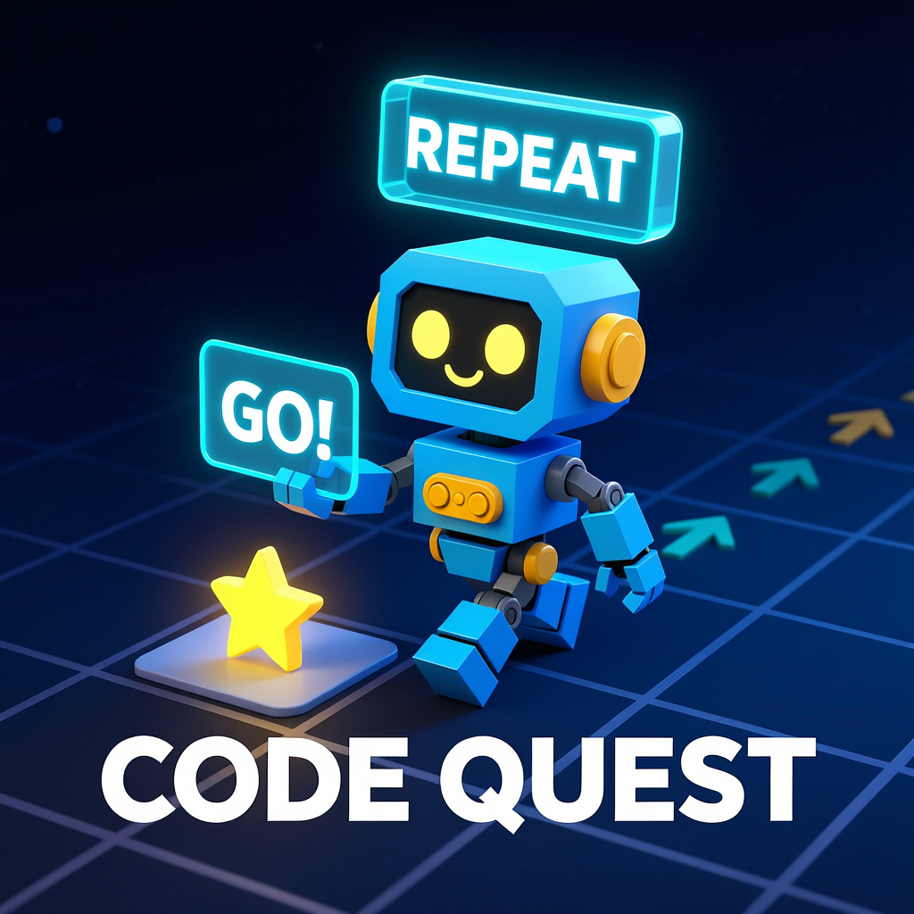

# Robot Coder - Образовательная игра по программированию

Увлекательная образовательная игра, которая учит основам программирования через визуальное блочное программирование. Управляйте роботом через сложные уровни, создавая программы с помощью перетаскивания команд!

##  О игре

Robot Coder - это инновационная образовательная платформа, разработанная для детей в возрасте от 10 до 15 лет для изучения основ программирования в увлекательной и интерактивной среде. Игроки управляют роботом через уровни на сетке, расставляя визуальные блоки программирования и постепенно осваивая концепции от простых последовательностей до продвинутых условных операторов.

### Основные возможности
- **Визуальный интерфейс программирования** - Интуитивная система блоков с перетаскиванием
- **Прогрессирующая сложность** - Более 10 уровней с постепенным введением концепций программирования
- **Образовательная направленность** - Обучение последовательностям, циклам и условным операторам
- **Кроссплатформенность** - Работает на ПК и в браузерах WebGL
##  Обзор геймплея

### Основные механики
- **3D вид сверху на сетке** - Навигация робота на шахматной доске
- **Визуальное блочное программирование** - Сборка команд перетаскиванием блоков
- **Выполнение в реальном времени** - Наблюдение за выполнением программы шаг за шагом

### Концепции программирования
| Диапазон уровней | Обучаемые концепции | Ключевые особенности |
|------------------|---------------------|----------------------|
| 1-5 | Последовательности | Базовые команды движения |
| 6-10 | Циклы | Блоки повторения X раз |
| 11+ | Условные операторы | Логика ЕСЛИ/ИНАЧЕ |

### Доступные команды
-  **Двигаться вперед** - Переместиться на одну клетку вперед
-  **Повернуть налево** - Повернуть на 90° против часовой стрелки
-  **Повернуть направо** - Повернуть на 90° по часовой стрелке
-  **Прыгнуть** - Перепрыгнуть через препятствия
-  **Взаимодействовать** - Активировать объекты
-  **Цикл While** - Активировать объекты
-  -  **Оператор IF Else ** - Активировать объекты

## 📚 Документация

- [Системная документация](SYSTEM_DOCUMENTATION_RU.md) - Полная техническая документация

## 📄 Лицензия

Этот проект является собственностью и предназначен для коммерческой деятельности.
